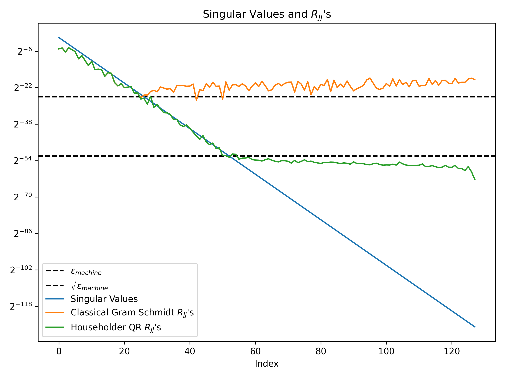

# hw02

## Problem 2

`apply_q_star_on_b` 和 `apply_q_on_x` 的实现在 `code/householder_qr.h` 中。

## Problem 4



## Problem 5

- Classical Gram Schmidt
```
Classical Gram Schmidt succeeded in 85.2687 seconds
Q^T*Q - I Frobenius norm: 6.17226e-09
Residual Frobenius norm: 1.69776e-12
```

- Householder QR
```
Householder QR factorization succeeded in 77.4543 seconds
Q^T*Q - I Frobenius norm: 2.503e-13
Residual Frobenius norm: 9.73741e-12
```

- dgeqrf from LAPACK
```
QR factorization succeeded in 4.68992 seconds
Q^T*Q - I Frobenius norm: 1.66368e-13
Residual Frobenius norm: 3.51056e-12
```
